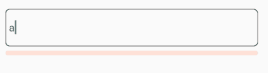

<h1 align="center">
react-native-password-validations
</h1>
react-native-password-validations
A password component for handling different validations



## Usage

```bash
npm i input-password-validations
```

```jsx
import {InputField} from 'input-password-validations';

const MyComponent() {
  return (
    <View>
      <InputField numbers={4} upperCase={3} characters={2} letters={4} />
    </View>
  );
}
```

## Properties

### `numbers?: number`

 Specifies the numbers to include

---
### `upperCase?: number`

 Specifies the capital letters to include

---

### `characters?: number`

Specifies the number of characters to include

---
### `letters?: number`

Specify the number of letters to include

---
### `style?`

A React Native style


